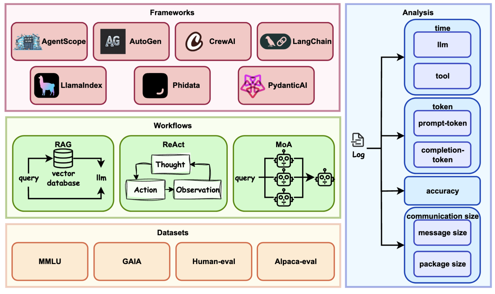

<div align=center>
  
# AgentRace: Benchmarking Efficiency in LLM Agent Frameworks
</div>

This is the official repo of paper [***AgentRace: Benchmarking Efficiency in LLM Agent Frameworks***](https://agent-race.github.io/AgentRace.pdf).


<div align=center>

</div>

## Abstract

Large Language Model (LLM) agents are rapidly gaining traction across domains such as intelligent assistants, programming aids, and autonomous decision systems. While existing benchmarks focus primarily on evaluating the effectiveness of LLM agents, such as task success rates and reasoning correctness, the efficiency of agent frameworks remains an underexplored but critical factor for real-world deployment. In this work, we introduce AgentRace, the first benchmark specifically designed to systematically evaluate the efficiency of LLM agent frameworks across representative workloads. AgentRace enables controlled, reproducible comparisons of runtime performance, scalability, communication overhead, and tool invocation latency across popular frameworks such as LangChain, AutoGen, and AgentScope. It supports multiple agent workflows (ReAct, RAG, Mixture-of-Agents), diverse task scenarios, and key performance metrics via a modular design and a one-command execution interface. Our experiments reveal key performance bottlenecks and highlight the trade-offs between different framework and workflow choices under varied deployment conditions. All results and benchmarking tools are open-sourced with a public leaderboard to foster community adoption. We believe AgentRace will become a valuable resource for guiding the design and optimization of next-generation efficient LLM agent systems. The results are available at https://agent-race.github.io/.

## Quick Start

### Clone the Repository
First, clone the project repository to your local machine:
```Bash 
git clone https://github.com/agent-race/AgentRace.git
```
### Set Up a Virtual Environment

```Bash
conda create -n agentrace python=3.10
```

### Install Dependencies
Install all required Python packages using:

```Bash
pip install -r requirements.txt
```

### Download Datasets
Download the corresponding dataset and place it in the appropriate location under the `.data` folder.

### Add API Keys in the `.env` File

```
OPENAI_API_KEY="xxxxx"
TOGETHER_API_KEY="xxxxx"
TOGETHER_BASE_URL="xxxx"
GOOGLE_API_KEY="xxxxx"
GOOGLE_CSE_ID="xxxxxx"
HF_TOKEN="the hugging face access token that can access datasets/gaia-benchmark/GAIA"
```

### Run the Project
```Bash
python main.py
```


## Configs

This project supports the following frameworks: **langchain, agentscope, autogen, llamaindex, crewai, phidata, pydantic**.
The supported datasets include: **mmlu, gaia, humaneval, alpaca_eval**.

Taking langchain as the framework and mmlu as the dataset as an example, the configuration file format is as follows:


```YAML
frameworks:
    - langchain
datasets:
    - mmlu
```
